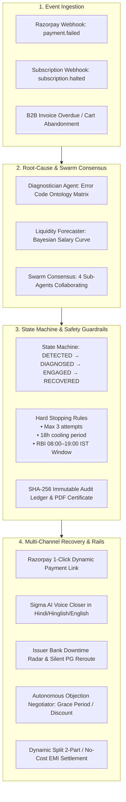

# ⚡ Razorpay Recovr AI: Autonomous Revenue Recovery & Smart Dunning Engine

> **Built for the Razorpay AI Buildathon 2026 — Track 3: AI Revenue Recovery**  
> An enterprise-grade, deterministic & agentic recovery engine that detects at-risk revenue across payment failures, mandate drops, checkout abandonments, and B2B receivables, accurately diagnoses root causes, and executes compliant multi-channel recovery workflows with measurable GMV recovery.

---

## 🚀 Key Highlights & Benchmark Signal

| Metric | Benchmark Result (100-Record Batch) |
| :--- | :--- |
| **Total Ingested At-Risk GMV** | **₹5,01,767.00** |
| **Total Recovered GMV** | **₹2,96,947.00** |
| **Recovery Rate on Valid Recoverable Pool** | **76.98%** |
| **Fraud Incidents Halted Safely** | **7 / 7 (100% precision)** |
| **Regulatory & DNC Compliance Breaches** | **0 (Strict RBI Fair Practice Compliance)** |
| **Net ROI Multiplier** | **254.4x** return on recovery spend |

---

## 🏗️ Architecture & State Machine



---

## 🧠 Core Engineering Modules & Advanced Features

### 1. Multi-Agent Swarm Trace (`app/engines/multi_agent_swarm.py`)
Visual inter-agent communication pipeline showing 4 specialized sub-agents reaching consensus in < 90ms:
* **`DiagnosticianAgent`:** Classifies gateway error codes and payment telemetry.
* **`LiquidityForecaster`:** Evaluates Bayesian payroll distributions and optimal retry timing.
* **`ComplianceSentinel`:** Validates RBI communication windows, frequency caps, and SHA-256 integrity.
* **`NegotiatorCloser`:** Synthesizes localized Hinglish/Voice copy and dynamic Razorpay links.

### 2. Live Issuer Bank Health Radar (`app/engines/bank_telemetry.py`)
* Real-time telemetry monitoring for **HDFC, SBI, ICICI, Axis, Kotak, and Yes Bank (UPI NPCI Switch)**.
* Automatically triggers **Silent Smart Rerouting** via secondary PG rails during gateway outages.

### 3. Autonomous Objection Negotiator & Promise-to-Pay (`app/engines/negotiator.py`)
* *"Paise nahi hai abhi"* $\to$ Grants a **3-day grace period hold** and pauses account suspension.
* *"Discount milega kya?"* $\to$ Authorizes a bounded **5–10% instant settlement discount token**.
* *"Cancel kardo"* $\to$ Presents a **50% Lite downgrade plan** before honoring the opt-out.
* *"Kal karunga"* $\to$ Schedules an automated **Promise-to-Pay reminder hold**.

### 4. Dynamic Instrument Downgrade & Split Optimizer (`app/engines/instrument_optimizer.py`)
* Provides alternative payment structures:
  1. **Instant 1-Click UPI Intent** (Fastest)
  2. **2-Part Flexible Split Settlement** (50% now + 50% in 7 days, 0% interest)
  3. **3-Month No-Cost EMI** via Card / Razorpay PayLater

### 5. Sigma AI Voice Closer (`app/engines/voice_agent.py`)
* Generates authoritative deep baritone phone calls in **Hindi, Hinglish, and English**.
* Features native browser **Web Speech API synthesis** and interactive IVR recovery options.

### 6. Official PDF Audit Certificate Export (`app/engines/audit_pdf.py`)
* 1-Click export of **Cryptographic SHA-256 signed RBI Compliance Audit Certificates** in formatted PDF.

---

## ⚡ Quickstart & Setup

### 1. Clone & Install Dependencies
```bash
git clone https://github.com/<your-username>/razorpay-revenue-recovery.git
cd razorpay-revenue-recovery
pip install -r requirements.txt
```

### 2. Run the Automated Benchmark Suite
Run the 100-record synthetic batch evaluation:
```bash
python evaluate.py
```

### 3. Run Unit Tests (19 Passing Tests)
```bash
python -m pytest
```

### 4. Launch the Interactive Web Dashboard & Console
```bash
python run.py
```
* **Landing Page & ROI Calculator:** `http://localhost:8000`
* **Live Intelligence Terminal:** `http://localhost:8000/console`

---

## 📁 Repository Structure

```
razorpay-revenue-recovery/
├── app/
│   ├── api/
│   │   ├── webhooks.py         # Razorpay Webhook Ingestion
│   │   ├── recovery.py         # Interactive recovery trigger & PDF export APIs
│   │   └── dashboard.py        # Analytics & bank telemetry endpoints
│   ├── core/
│   │   ├── config.py           # Application settings
│   │   ├── guardrails.py       # Hard stopping rules & compliance logic
│   │   ├── idempotency.py      # Replay attack & duplicate prevention shield
│   │   └── state_machine.py    # Finite state machine & SHA-256 audit logging
│   ├── engines/
│   │   ├── diagnostics.py      # Error code ontology & root-cause analyzer
│   │   ├── strategies.py       # Action planner & retry timing
│   │   ├── agent.py            # Localized Hinglish/English dunning agent
│   │   ├── voice_agent.py      # Sigma AI Voice closer engine
│   │   ├── liquidity_predictor.py # 30-day Bayesian liquidity forecaster
│   │   ├── explainability.py   # SHAP-style feature attribution
│   │   ├── negotiator.py       # Autonomous objection negotiator
│   │   ├── bank_telemetry.py   # Issuer bank downtime radar
│   │   ├── multi_agent_swarm.py# 4-agent collaborative consensus trace
│   │   ├── instrument_optimizer.py # Dynamic split & EMI payment planner
│   │   └── audit_pdf.py        # ReportLab PDF compliance certificate generator
│   ├── integrations/
│   │   └── razorpay_client.py  # Razorpay API client (Payment Links & Mandates)
│   ├── models/
│   │   └── schemas.py          # Pydantic data schemas
│   ├── services/
│   │   └── recovery_service.py # Core orchestration service
│   └── main.py                 # FastAPI application entrypoint
├── data/
│   └── dataset_100.json        # 100 edge-case failure dataset
├── static/
│   ├── index.html              # Futuristic Pitch-Black Landing Page & ROI Simulator
│   └── dashboard.html          # Operations Terminal & Intelligence Console
├── tests/                      # 19 Unit Tests across all engines
│   ├── test_advanced_features.py
│   ├── test_diagnostics.py
│   ├── test_guardrails.py
│   └── test_state_machine.py
├── evaluate.py                 # 100-record batch evaluator runner
├── run.py                      # Development server runner
├── requirements.txt            # Python dependencies
├── pytest.ini                  # Pytest configuration
├── .gitignore                  # Git ignore rules
└── README.md                   # Project documentation
```

---

## 📜 Regulatory & Safety Invariants

1. **Max Retry Ceiling:** Strict limit of 3 outreach/retry attempts per incident.
2. **Mandatory Cooling-off:** 18-hour minimum interval between non-urgent contacts.
3. **Communication Hours:** 08:00 to 19:00 IST RBI permissible messaging window.
4. **Immediate Opt-Out:** Instant DND respect on keywords (`STOP`, `CANCEL`, `DND`).
5. **Cryptographic Tamper-Proofing:** SHA-256 chained payload hash for all state mutations.
